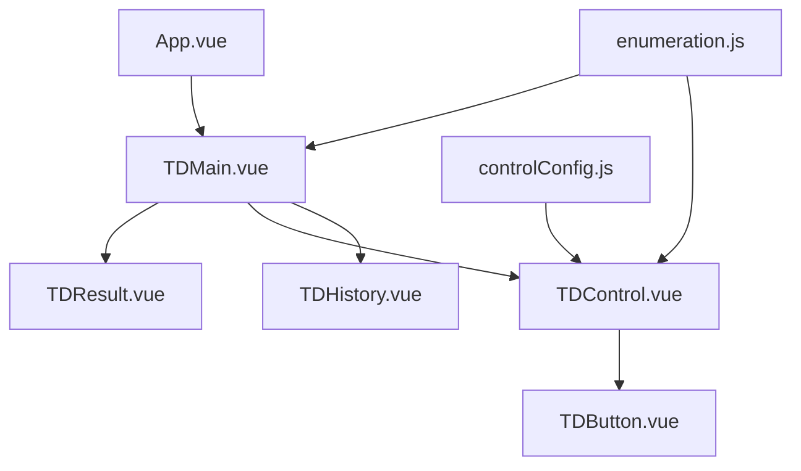
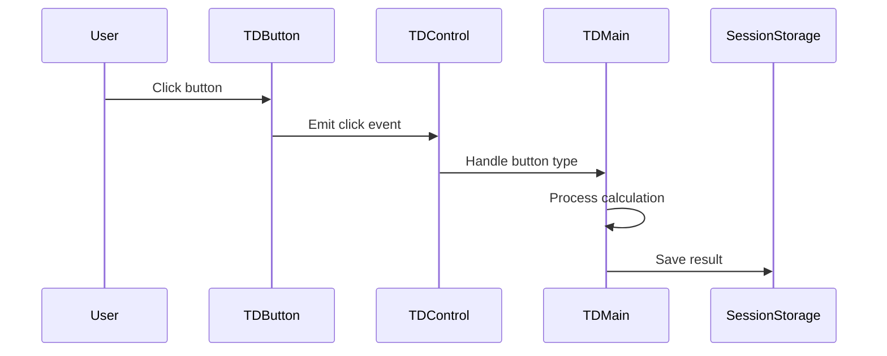

# System Patterns

## Architecture Overview

## Component Structure
1. **App.vue**
   - Container component
   - Chỉ render TDMain.vue

2. **TDMain.vue**
   - Component chính của máy tính
   - Quản lý state và logic tính toán
   - Render TDResult và TDControl

3. **TDResult.vue**
   - Hiển thị kết quả tính toán
   - Nhận kết quả qua props

4. **TDControl.vue**
   - Phần điều khiển với các nút bấm
   - Sử dụng controlConfig để render các nút
   - Emit events lên TDMain để xử lý

5. **TDButton.vue**
   - Component cơ bản cho các nút
   - Có 2 kích thước: Normal và Double

6. **TDHistory.vue**
   - Hiển thị lịch sử tính toán
   - Hỗ trợ cuộn chuột và kéo thả
   - Sử dụng Drag and Drop Pattern để xử lý kéo thả:
     * mousedown: Bắt đầu kéo
     * mousemove: Tính toán vị trí cuộn
     * mouseup/mouseleave: Kết thúc kéo

## Event Flow

## Data Flow Patterns
1. **Button Configuration**
   - Định nghĩa nút trong controlConfig.js
   - Mỗi nút có: type, name, key, size

2. **State Management**
   - Tập trung tại TDMain.vue
   - State gồm:
     * Số thứ nhất (prevNumber)
     * Số thứ hai (nextNumber)
     * Trạng thái nhập (state)
     * Dấu phép tính (calculationSign)

3. **Calculation Logic**
   - Xử lý trong TDMain.vue
   - Các methods chính:
     * typeNumber: Nhập số
     * typeSimpleFunction: Xử lý phép tính
     * typeCalulate: Tính kết quả
     * typeComma: Xử lý số thập phân
     * typeOther: Xử lý các chức năng phụ

## Enums và Constants
- **buttonName**: Tên các nút
- **buttonType**: Loại nút (Number, SimpleFunction, Calculate, etc.)
- **buttonSize**: Kích thước nút
- **state**: Trạng thái nhập
- **calculationSign**: Dấu phép tính
